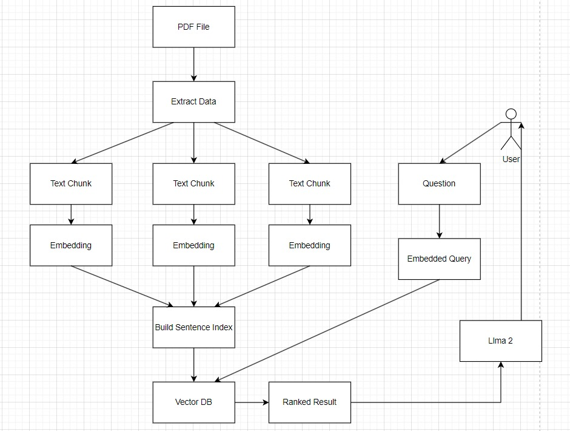
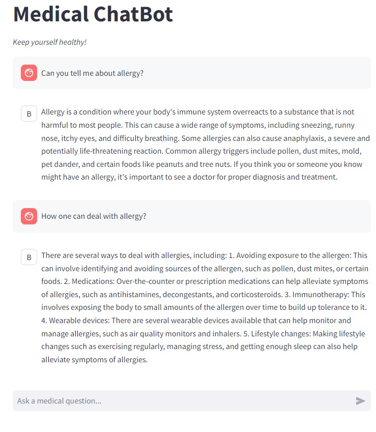

# Medical_ChatBot

Medical_ChatBot is an advanced medical chatbot designed to assist with clinical queries and provide information based on medical literature. It leverages state-of-the-art models and embeddings to deliver accurate and reliable responses.

## Workflow


## Features

### Medical Expertise:
Provides information based on extensive training on medical literature.

### Advanced Model:
Utilizes the Llama-2-7B-Chat model from Hugging Face.

### Vector Database:
Incorporates Pinecone DB for efficient data retrieval.

### High-Quality Embeddings:
Uses sentence-transformers/all-MiniLM-L6-v2 embeddings from Hugging Face.

## Model Details

### Llama-2-7B-Chat Model:
- **Source:** [Link](https://huggingface.co/TheBloke/Llama-2-7B-Chat-GGML/tree/main)
- **Description:** An open-source large language model optimized for chat-based interactions, capable of understanding and generating human-like text.


## Database 

### Pinecone DB:
Pinecone is a vector database designed for fast retrieval and similarity search of high-dimensional data


## Training Data
Medical_ChatBot is trained on embeddings derived from the following medical books:
- Gale Encyclopedia of Medicine Vol. 2 

## Installation

To set up Medical_ChatBot, follow these steps:

### Clone the Repository:
```bash
git clone https://github.com/shivamkr17/Medical_ChatBot
cd Medical_ChatBot
```
### Install Dependencies:
- pip install -r requirements.txt

### Download the Model and Embeddings:
- Llama-2-7B-Chat model: Download from Hugging Face and place it in the models directory.
- Sentence-Transformers embeddings: Download from Hugging Face and place them in the embeddings directory.
- Set Up Pinecone DB

#### Run the Medical_ChatBot application with the following command:
- streamlit run app.py

## Demo for Medical_ChatBot



